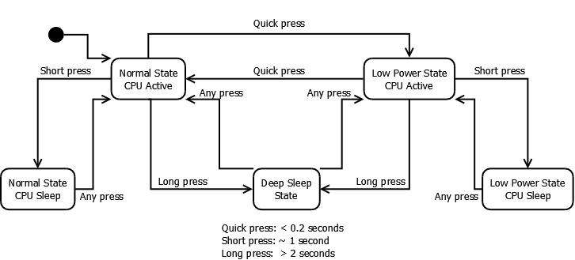
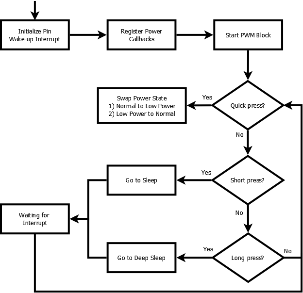

# PSoC&trade; 6 MCU: Switching between power modes

This example demonstrates how to transition PSoC&trade; 6 MCU to the following system and MCU power states:

- System power states - Normal power state/low-power state
- MCU power states - Active/sleep/deep sleep

[View this README on GitHub.](https://github.com/Infineon/mtb-example-psoc6-switching-power-modes)

[Provide feedback on this code example.](https://cypress.co1.qualtrics.com/jfe/form/SV_1NTns53sK2yiljn?Q_EED=eyJVbmlxdWUgRG9jIElkIjoiQ0UyMTk4ODEiLCJTcGVjIE51bWJlciI6IjAwMi0xOTg4MSIsIkRvYyBUaXRsZSI6IlBTb0MmdHJhZGU7IDYgTUNVOiBTd2l0Y2hpbmcgYmV0d2VlbiBwb3dlciBtb2RlcyIsInJpZCI6InJsb3MiLCJEb2MgdmVyc2lvbiI6IjMuMS4wIiwiRG9jIExhbmd1YWdlIjoiRW5nbGlzaCIsIkRvYyBEaXZpc2lvbiI6Ik1DRCIsIkRvYyBCVSI6IklDVyIsIkRvYyBGYW1pbHkiOiJQU09DIn0=)

## Overview

This code example shows how to enter system normal and low-power states, and transition to MCU active, sleep, or deep sleep power states. The system power states affect the whole device, while the MCU power states affect only one CPU. After transitioning to deep sleep or sleep power state, the example also shows how to wake up and return to Normal or Low Power state.

This example does not cover hibernate mode. For more information on this mode, see the PSoC&trade; 6 MCU documentation. [AN219528 - PSoC&trade; 6 MCU low-power modes and power reduction techniques](https://www.infineon.com/dgdl/Infineon-AN219528_PSoC_6_MCU_Low-Power_Modes_and_Power_Reduction_Techniques-ApplicationNotes-v05_00-EN.pdf?fileId=8ac78c8c7cdc391c017d0d31efdc659f&utm_source=cypress&utm_medium=referral&utm_campaign=202110_globe_en_all_integration-an_vanitylink) provides additional details on the PSoC&trade; 6 MCU power modes, use of the SysPM driver, and other recommendations for reducing power consumption. Some nomenclature between the CYHAL driver and the PSoC&trade; 6 PDL are different as follows:

**Table 1. Power management nomenclature differences**

| **CYHAL driver** | **PSoC&trade; 6 PDL** |
|------------------|----------------|
| Normal state     | Low-power mode |
| Low-power state  | Ultra-low-power mode |
| MCU active       | CPU active     |
| MCU sleep        | CPU sleep      |

The project uses a kit button to change the power state. Figure 1 shows the state machine implemented in the firmware to execute the transitions.

**Figure 1. Power state machine**



The project also uses one LED to indicate the selected power state.  Table 2 shows the state of the LED for each mode.

**Table 2. LED states in various power states**

| **Power/MCU states** | **LED state** |
|-------------------------|---------------|
| Normal power/MCU active | Blinks rapidly |
| Normal power/MCU sleep | Turned ON and bright |
| Low-power/MCU active | Blinks slowly |
| Low-power/MCU sleep | Turned ON and dimmed |
| Deep sleep | Turned OFF |

## Requirements

- [ModusToolbox&trade; software](https://www.infineon.com/modustoolbox) v3.0 or later (tested with v3.0)
- Board support package (BSP) minimum required version: 4.0.0
- Programming language: C
- Associated parts: All [PSoC&trade; 6 MCU](https://www.infineon.com/cms/en/product/microcontroller/32-bit-psoc-arm-cortex-microcontroller/psoc-6-32-bit-arm-cortex-m4-mcu/?utm_source=cypress&utm_medium=referral&utm_campaign=202110_globe_en_all_integration-product_families) parts

## Supported toolchains (make variable 'TOOLCHAIN')

- GNU Arm&reg; embedded compiler v10.3.1 (`GCC_ARM`) - Default value of `TOOLCHAIN`
- Arm&reg; compiler v6.16 (`ARM`)
- IAR C/C++ compiler v9.30.1 (`IAR`)

## Supported kits (make variable 'TARGET')

- [PSoC&trade; 6 Wi-Fi Bluetooth&reg; prototyping kit](https://www.infineon.com/CY8CPROTO-062-4343W) (`CY8CPROTO-062-4343W`) - Default value of `TARGET`
- [PSoC&trade; 6 Wi-Fi Bluetooth&reg; pioneer kit](https://www.infineon.com/CY8CKIT-062-WIFI-BT) (`CY8CKIT-062-WIFI-BT`)
- [PSoC&trade; 6 Bluetooth&reg; LE pioneer kit](https://www.infineon.com/CY8CKIT-062-BLE) (`CY8CKIT-062-BLE`)
- [PSoC&trade; 6 Bluetooth&reg; LE prototyping kit](https://www.infineon.com/CY8CPROTO-063-BLE) (`CY8CPROTO-063-BLE`)
- [PSoC&trade; 62S1 Wi-Fi Bluetooth&reg; pioneer kit](https://www.infineon.com/CYW9P62S1-43438EVB-01) (`CYW9P62S1-43438EVB-01`)
- [PSoC&trade; 62S1 Wi-Fi Bluetooth&reg; pioneer kit](https://www.infineon.com/CYW9P62S1-43012EVB-01) (`CYW9P62S1-43012EVB-01`)
- [PSoC&trade; 62S2 Wi-Fi Bluetooth&reg; pioneer kit](https://www.infineon.com/CY8CKIT-062S2-43012) (`CY8CKIT-062S2-43012`)
- [PSoC&trade; 62S2 evaluation kit](https://www.infineon.com/CY8CEVAL-062S2) (`CY8CEVAL-062S2`, `CY8CEVAL-062S2-LAI-4373M2`)
- [PSoC&trade; 62S3 Wi-Fi Bluetooth&reg; prototyping kit](https://www.infineon.com/CY8CPROTO-062S3-4343W) (`CY8CPROTO-062S3-4343W`)
- [PSoC&trade; 62S4 pioneer kit](https://www.infineon.com/CY8CKIT-062S4) (`CY8CKIT-062S4`)
- [PSoC&trade; 64 "Secure Boot" Wi-Fi Bluetooth&reg; pioneer kit](https://www.infineon.com/CY8CKIT-064B0S2-4343W) (`CY8CKIT-064B0S2-4343W`)
- Rapid IoT connect developer kit (CYSBSYSKIT-DEV-01)

## Hardware setup

This example uses the board's default configuration. See the kit user guide to ensure that the board is configured correctly.

The example does not require any additional hardware to run. However, you can connect an ammeter to measure the current consumed by the PSoC&trade; MCU device. If using any of the PSoC&trade; 6 MCU pioneer kits, remove the PWR_MON jumper from the kit and connect the ammeter on the header pins. This jumper is at the bottom side of the PSoC&trade; 6 MCU pioneer kits. See the kit guide for the exact location. If using a prototyping board kit, see the kit guide how to measure the current. It might require changes in the hardware.

**Note:** The PSoC&trade; 6 Bluetooth&reg; LE pioneer kit (CY8CKIT-062-BLE) and the PSoC&trade; 6 Wi-Fi Bluetooth&reg; pioneer kit (CY8CKIT-062-WIFI-BT) ship with KitProg2 installed. The ModusToolbox&trade; software requires KitProg3. Before using this code example, make sure that the board is upgraded to KitProg3. The tool and instructions are available in the [Firmware Loader](https://github.com/Infineon/Firmware-loader) GitHub repository. If you do not upgrade, you will see an error like "unable to find CMSIS-DAP device" or "KitProg firmware is out of date".

## Software setup

This example requires no additional software or tools.

## Using the code example

Create the project and open it using one of the following:

<details><summary><b>In Eclipse IDE for ModusToolbox&trade; software</b></summary>

1. Click the **New Application** link in the **Quick Panel** (or, use **File** > **New** > **ModusToolbox Application**). This launches the [Project Creator](https://www.infineon.com/ModusToolboxProjectCreator) tool.

2. Pick a kit supported by the code example from the list shown in the **Project Creator - Choose Board Support Package (BSP)** dialog.

   When you select a supported kit, the example is reconfigured automatically to work with the kit. To work with a different supported kit later, use the [Library Manager](https://www.infineon.com/ModusToolboxLibraryManager) to choose the BSP for the supported kit. You can use the Library Manager to select or update the BSP and firmware libraries used in this application. To access the Library Manager, click the link from the **Quick Panel**.

   You can also just start the application creation process again and select a different kit.

   If you want to use the application for a kit not listed here, you may need to update the source files. If the kit does not have the required resources, the application may not work.

3. In the **Project Creator - Select Application** dialog, choose the example by enabling the checkbox.

4. (Optional) Change the suggested **New Application Name**.

5. The **Application(s) Root Path** defaults to the Eclipse workspace which is usually the desired location for the application. If you want to store the application in a different location, you can change the *Application(s) Root Path* value. Applications that share libraries should be in the same root path.

6. Click **Create** to complete the application creation process.

For more details, see the [Eclipse IDE for ModusToolbox&trade; software user guide](https://www.infineon.com/MTBEclipseIDEUserGuide) (locally available at *{ModusToolbox&trade; software install directory}/ide_{version}/docs/mt_ide_user_guide.pdf*).

</details>

<details><summary><b>In command-line interface (CLI)</b></summary>

ModusToolbox&trade; software provides the Project Creator as both a GUI tool and the command line tool, "project-creator-cli". The CLI tool can be used to create applications from a CLI terminal or from within batch files or shell scripts. This tool is available in the *{ModusToolbox&trade; software install directory}/tools_{version}/project-creator/* directory.

Use a CLI terminal to invoke the "project-creator-cli" tool. On Windows, use the command line "modus-shell" program provided in the ModusToolbox&trade; software installation instead of a standard Windows command-line application. This shell provides access to all ModusToolbox&trade; software tools. You can access it by typing `modus-shell` in the search box in the Windows menu. In Linux and macOS, you can use any terminal application.

The "project-creator-cli" tool has the following arguments:

Argument | Description | Required/optional
---------|-------------|-----------
`--board-id` | Defined in the `<id>` field of the [BSP](https://github.com/Infineon?q=bsp-manifest&type=&language=&sort=) manifest | Required
`--app-id`   | Defined in the `<id>` field of the [CE](https://github.com/Infineon?q=ce-manifest&type=&language=&sort=) manifest | Required
`--target-dir`| Specify the directory in which the application is to be created if you prefer not to use the default current working directory | Optional
`--user-app-name`| Specify the name of the application if you prefer to have a name other than the example's default name | Optional

<br>

The following example will clone the "[Hello World](https://github.com/Infineon/mtb-example-psoc6-hello-world)" application with the desired name "MyHelloWorld" configured for the *CY8CKIT-062-WIFI-BT* BSP into the specified working directory, *C:/mtb_projects*:

   ```
   project-creator-cli --board-id CY8CKIT-062-WIFI-BT --app-id mtb-example-psoc6-hello-world --user-app-name MyHelloWorld --target-dir "C:/mtb_projects"
   ```

**Note:** The project-creator-cli tool uses the `git clone` and `make getlibs` commands to fetch the repository and import the required libraries. For details, see the "Project creator tools" section of the [ModusToolbox&trade; software user guide](https://www.cypress.com/ModusToolboxUserGuide) (locally available at *{ModusToolbox&trade; software install directory}/docs_{version}/mtb_user_guide.pdf*).

To work with a different supported kit later, use the [Library Manager](https://www.infineon.com/ModusToolboxLibraryManager) to choose the BSP for the supported kit. You can invoke the Library Manager GUI tool from the terminal using `make library-manager` command or use the Library Manager CLI tool "library-manager-cli" to change the BSP.

The "library-manager-cli" tool has the following arguments:

Argument | Description | Required/optional
---------|-------------|-----------
`--add-bsp-name` | Name of the BSP that should be added to the application | Required
`--set-active-bsp` | Name of the BSP that should be as active BSP for the application | Required
`--add-bsp-version`| Specify the version of the BSP that should be added to the application if you do not wish to use the latest from manifest | Optional
`--add-bsp-location`| Specify the location of the BSP (local/shared) if you prefer to add the BSP in a shared path | Optional

<br />

Following example adds the CY8CPROTO-062-4343W BSP to the already created application and makes it the active BSP for the app:

   ```
   library-manager-cli --project "C:/mtb_projects/MyHelloWorld" --add-bsp-name CY8CPROTO-062-4343W --add-bsp-version "latest-v4.X" --add-bsp-location "local"

   library-manager-cli --project "C:/mtb_projects/MyHelloWorld" --set-active-bsp APP_CY8CPROTO-062-4343W
   ```

</details>

<details><summary><b>In third-party IDEs</b></summary>

Use one of the following options:

- **Use the standalone [Project Creator](https://www.infineon.com/dgdl/Infineon-ModusToolbox_Project_Creator_Guide_3-UserManual-v01_00-EN.pdf?fileId=8ac78c8c7d718a49017d99bcabbd31e5&utm_source=cypress&utm_medium=referral&utm_campaign=202110_globe_en_all_integration-files) tool:**

   1. Launch Project Creator from the Windows Start menu or from *{ModusToolbox&trade; software install directory}/tools_{version}/project-creator/project-creator.exe*.

   2. In the initial **Choose Board Support Package** screen, select the BSP, and click **Next**.

   3. In the **Select Application** screen, select the appropriate IDE from the **Target IDE** drop-down menu.

   4. Click **Create** and follow the instructions printed in the bottom pane to import or open the exported project in the respective IDE.

<br>

- **Use command-line interface (CLI):**

   1. Follow the instructions from the **In command-line interface (CLI)** section to create the application.

   2. Export the application to a supported IDE using the `make <ide>` command.

   3. Follow the instructions displayed in the terminal to create or import the application as an IDE project.

For a list of supported IDEs and more details, see the "Exporting to IDEs" section of the [ModusToolbox&trade; software user guide](https://www.infineon.com/ModusToolboxUserGuide) (locally available at *{ModusToolbox&trade; software install directory}/docs_{version}/mtb_user_guide.pdf*).

</details>


## Operation

If using a PSoC&trade; 64 "Secure" MCU kit (like CY8CKIT-064B0S2-4343W), the PSoC&trade; 64 device must be provisioned with keys and policies before being programmed. Follow the instructions in the ["Secure Boot" SDK user guide](https://www.cypress.com/documentation/software-and-drivers/psoc-64-secure-mcu-secure-boot-sdk-user-guide) to provision the device. If the kit is already provisioned, copy-paste the keys and policy folder to the application folder.

1. Program the board using one of the following:

   <details><summary><b>Using Eclipse IDE for ModusToolbox&trade; software</b></summary>

      1. Select the application project in the Project Explorer.

      2. In the **Quick Panel**, scroll down, and click **\<Application Name> Program (KitProg3_MiniProg4)**.
   </details>

   <details><summary><b>Using CLI</b></summary>

     From the terminal, execute the `make program` command to build and program the application using the default toolchain to the default target. The default toolchain is specified in the application's Makefile but you can override this value manually:
      ```
      make program TOOLCHAIN=<toolchain>
      ```

      Example:
      ```
      make program TOOLCHAIN=GCC_ARM
      ```
   </details>

2. After programming, the application starts automatically. Confirm that kit LED blinks at 5 Hz (approximately). Take note of the current consumption. The device is in the normal power/MCU active state at this moment.

3. Press the kit button for approximately one second and release it. Observe that the LED is ON and fully bright. Confirm that the current consumption drops a few hundreds of microamperes. The device is in the normal power/MCU sleep state at this moment.

4. Quickly press the kit button to return to Normal power/MCU active state. Observe that the LED blinks quickly again.

5. Press the kit button for at least two seconds and release it. Observe that the LED is OFF and that the current consumption has dropped to a few microamperes. The device is in deep sleep state at this moment.

6. Quickly press the kit button to return to normal power state. Observe that the LED blinks quickly and that the current consumption has increased to the same level measured before.

7. Quickly press the kit button again to enter low-power state. Observe that the LED blinks slowly and that the current consumption has dropped significantly when compared to normal power state. You can quickly press the kit button to switch between the two modes.

8. Keep the device in low-power state and press the kit button for approximately one second and release it. Observe that the LED dims and that the current consumption has dropped a few hundred microamperes. The device is in the low-power/MCU sleep state at this moment.

9. Quickly press the kit button to return to the low-power/MCU active state. Observe that the is blinking slowly again.

10. Press the kit button for at least two seconds and release it. Observe that the LED is OFF and that the current consumption has dropped to a few microamperes. The device is in deep sleep state at this moment.

11. Quickly press the user button and return to the low-power/MCU active state. Observe that the LED blinks slowly again and that the current consumption has increased to the same level measured before.

## Debugging

You can debug the example to step through the code. In the IDE, use the **\<Application Name> Debug (KitProg3_MiniProg4)** configuration in the **Quick Panel**. For more details, see the "Program and debug" section in the [Eclipse IDE for ModusToolbox&trade; software user guide](https://www.infineon.com/dgdl/Infineon-Eclipse_IDE_for_ModusToolbox_User_Guide_1-UserManual-v01_00-EN.pdf?fileId=8ac78c8c7d718a49017d99bcb86331e8&utm_source=cypress&utm_medium=referral&utm_campaign=202110_globe_en_all_integration-files).

**Note:** **(Only while debugging)** On the CM4 CPU, some code in `main()` may execute before the debugger halts at the beginning of `main()`. This means that some code executes twice - once before the debugger stops execution, and again after the debugger resets the program counter to the beginning of `main()`. See [KBA231071](https://www.infineon.com/dgdl/Infineon-Eclipse_IDE_for_ModusToolbox_User_Guide_1-UserManual-v01_00-EN.pdf?fileId=8ac78c8c7d718a49017d99bcb86331e8&utm_source=cypress&utm_medium=referral&utm_campaign=202110_globe_en_all_integration-files) to learn about this and for the workaround.

## Design and implementation

This example configures the a PWM to blink, dim, and turn ON/OFF the LED. The firmware implements the state machine shown in the [Overview](#overview) section and controls the duty cycle of the PWM block. The device wakes up when a switch press is detected.

**Figure 2. Flowchart**



Two power management callback functions are registered (PWM and Clock callbacks). Table 3 shows the actions of each callback function for every power state. For more information on power callbacks, see the CYHAL driver - system power management.

**Table 3. Transition actions**

| Callback | Power state | CHECK_READY | CHECK_FAIL | BEFORE_TRANSITION | AFTER_TRANSITION |
|---|---| ---| --- | --- | --- |
| PWM callback | Sleep | Nothing | Nothing | If in low-power state, dim the LED. If in normal power state, turn ON the LED. | If in low -power state, blink the LED slowly. If in normal power state, blink the LED fast. |
| PWM callback | Deep sleep | Nothing | Nothing | Stop PWM | Re-enable the PWM block. If in low-power state, blink the LED slowly. If in normal power state, blink the LED fast. |
| PWM callback | Low-power | Nothing | Nothing | Nothing | Blink the LED slowly. |
| PWM callback | Normal power | Nothing | Nothing | Nothing | Blink the LED fast |
| Clock callback | Low-power | Nothing | Nothing | Reconfigure the System Clock to 50 MHz. | Nothing |
| Clock callback | Normal power | Nothing | Nothing | Nothing | Reconfigure the System Clock to 100 MHz |

<br>

### Resources and settings

**Table 4. Application resources**

| Resource  |  Alias/object     |    Purpose     |
| :------- | :------------    | :------------ |
| PWM (HAL) | pwm | Used to control the LED brightness |
| Clock (HAL) | system_clock | Used to configure the system clock |
| GPIO (HAL) | CYBSP_USER_BTN | Used to wake up the device and change power states |

<br>

## Related resources

Resources  | Links
-----------|----------------------------------
Application notes  | [AN228571](https://www.infineon.com/dgdl/Infineon-AN228571_Getting_started_with_PSoC_6_MCU_on_ModusToolbox_software-ApplicationNotes-v06_00-EN.pdf?fileId=8ac78c8c7cdc391c017d0d36de1f66d1&utm_source=cypress&utm_medium=referral&utm_campaign=202110_globe_en_all_integration-application_note) – Getting started with PSoC&trade; 6 MCU on ModusToolbox&trade; software <br>  [AN215656](https://www.infineon.com/dgdl/Infineon-AN215656_PSoC_6_MCU_Dual-CPU_System_Design-ApplicationNotes-v09_00-EN.pdf?fileId=8ac78c8c7cdc391c017d0d3180c4655f&utm_source=cypress&utm_medium=referral&utm_campaign=202110_globe_en_all_integration-application_note) – PSoC&trade; 6 MCU: Dual-CPU system design <br> [AN79953](https://www.infineon.com/dgdl/Infineon-AN79953_Getting_Started_with_PSoC_4-ApplicationNotes-v21_00-EN.pdf?fileId=8ac78c8c7cdc391c017d07271fd64bc1&utm_source=cypress&utm_medium=referral&utm_campaign=202110_globe_en_all_integration-application_note) – Getting started with PSoC&trade; 4 <br>  [AN85951](https://www.infineon.com/dgdl/Infineon-AN85951_PSoC_4_and_PSoC_6_MCU_CapSense_Design_Guide-ApplicationNotes-v27_00-EN.pdf?fileId=8ac78c8c7cdc391c017d0723535d4661&utm_source=cypress&utm_medium=referral&utm_campaign=202110_globe_en_all_integration-application_note) – PSoC&trade; 4 and PSoC&trade; 6 MCU CAPSENSE&trade; design guide
Code examples  | [Using ModusToolbox&trade; software](https://github.com/Infineon/Code-Examples-for-ModusToolbox-Software) on GitHub <br> [Using PSoC&trade; Creator](https://www.infineon.com/cms/en/design-support/software/code-examples/psoc-3-4-5-code-examples-for-psoc-creator/?utm_source=cypress&utm_medium=referral&utm_campaign=202110_globe_en_all_integration-code_example)
Device documentation | [PSoC&trade; 6 MCU datasheets](https://www.cypress.com/search/all?f[0]=meta_type%3Atechnical_documents&f[1]=resource_meta_type%3A575&f[2]=field_related_products%3A114026) <br> [PSoC&trade; 6 technical reference manuals](https://www.cypress.com/search/all/PSoC%206%20Technical%20Reference%20Manual?f[0]=meta_type%3Atechnical_documents&f[1]=resource_meta_type%3A583)<br> [PSoC&trade; 4 datasheets](https://www.infineon.com/cms/en/search.html#!term=all&view=all&utm_source=cypress&utm_medium=referral&utm_campaign=202110_globe_en_all_integration-doc_search) <br>[PSoC&trade; 4 technical reference manuals](https://www.cypress.com/search/all/PSoC%204%20Technical%20Reference%20Manual?sort_by=search_api_relevance&f%5B0%5D=meta_type%3Atechnical_documents)
Development kits | Visit www.cypress.com/microcontrollers-mcus-kits and use the options in the **Select your kit** section to filter kits by *Product family* or *Features*.
Libraries on GitHub  | [mtb-pdl-cat1](https://github.com/Infineon/mtb-pdl-cat1) – PSoC&trade; 6 peripheral driver library (PDL)  <br> [mtb-hal-cat1](https://github.com/Infineon/mtb-hal-cat1) – Hardware abstraction layer (HAL) library <br> [retarget-io](https://github.com/Infineon/retarget-io) – Utility library to retarget STDIO messages to a UART port
Middleware on GitHub  | [capsense](https://github.com/Infineon/capsense) – CAPSENSE&trade; library and documents <br> [psoc6-middleware](https://github.com/Infineon/modustoolbox-software#psoc-6-middleware-libraries) – Links to all PSoC&trade; 6 MCU middleware
Tools  | [Eclipse IDE for ModusToolbox&trade; software](https://www.infineon.com/cms/en/design-support/tools/sdk/modustoolbox-software/?utm_source=cypress&utm_medium=referral&utm_campaign=202110_globe_en_all_integration-product_families) – ModusToolbox&trade; software is a collection of easy-to-use software and tools enabling rapid development with Infineon MCUs, covering applications from embedded sense and control to wireless and cloud-connected systems using AIROC&trade; Wi-Fi and Bluetooth® connectivity devices.

<br>

## Other resources

Infineon provides a wealth of data at www.infineon.com to help you select the right device, and quickly and effectively integrate it into your design.

For PSoC&trade; 6 MCU devices, see [How to design with PSoC&trade; 6 MCU - KBA223067](https://community.infineon.com/t5/Knowledge-Base-Articles/How-to-Design-with-PSoC-6-MCU-KBA223067/ta-p/248857) in the Infineon Developer community.

## Document history

Document title: *CE219881* - *PSoC&trade; 6 MCU: Switching between power modes*

| Version | Description of change |
| ------- | --------------------- |
| 1.0.0   | New code example      |
| 1.1.0   | Updated to support ModusToolbox&trade; software v2.1<br />Updated to use HAL drivers for power management |
| 2.0.0   | Major update to support ModusToolbox&trade; software v2.2, added support for new kits<br /> This version is not backward compatible with ModusToolbox&trade; software v2.1  |
| 2.1.0   | Added support for CYSBSYSKIT-DEV-01 Rapid IoT Connect Developer Kit |
| 2.2.0   | Updated to support ModusToolbox&trade; software v2.3<br /> Added support for new kits  |
| 3.0.0   | Major update to support ModusToolbox&trade; v3.0 and BSPs v4.X. This version is not backward compatible with previous versions of ModusToolbox      |
| 3.1.0   | Fixed incorrect low power to active power switching sequence      |
------


© Cypress Semiconductor Corporation, 2020-2023. This document is the property of Cypress Semiconductor Corporation, an Infineon Technologies company, and its affiliates ("Cypress").  This document, including any software or firmware included or referenced in this document ("Software"), is owned by Cypress under the intellectual property laws and treaties of the United States and other countries worldwide.  Cypress reserves all rights under such laws and treaties and does not, except as specifically stated in this paragraph, grant any license under its patents, copyrights, trademarks, or other intellectual property rights.  If the Software is not accompanied by a license agreement and you do not otherwise have a written agreement with Cypress governing the use of the Software, then Cypress hereby grants you a personal, non-exclusive, nontransferable license (without the right to sublicense) (1) under its copyright rights in the Software (a) for Software provided in source code form, to modify and reproduce the Software solely for use with Cypress hardware products, only internally within your organization, and (b) to distribute the Software in binary code form externally to end users (either directly or indirectly through resellers and distributors), solely for use on Cypress hardware product units, and (2) under those claims of Cypress’s patents that are infringed by the Software (as provided by Cypress, unmodified) to make, use, distribute, and import the Software solely for use with Cypress hardware products.  Any other use, reproduction, modification, translation, or compilation of the Software is prohibited.
<br>
TO THE EXTENT PERMITTED BY APPLICABLE LAW, CYPRESS MAKES NO WARRANTY OF ANY KIND, EXPRESS OR IMPLIED, WITH REGARD TO THIS DOCUMENT OR ANY SOFTWARE OR ACCOMPANYING HARDWARE, INCLUDING, BUT NOT LIMITED TO, THE IMPLIED WARRANTIES OF MERCHANTABILITY AND FITNESS FOR A PARTICULAR PURPOSE.  No computing device can be absolutely secure.  Therefore, despite security measures implemented in Cypress hardware or software products, Cypress shall have no liability arising out of any security breach, such as unauthorized access to or use of a Cypress product. CYPRESS DOES NOT REPRESENT, WARRANT, OR GUARANTEE THAT CYPRESS PRODUCTS, OR SYSTEMS CREATED USING CYPRESS PRODUCTS, WILL BE FREE FROM CORRUPTION, ATTACK, VIRUSES, INTERFERENCE, HACKING, DATA LOSS OR THEFT, OR OTHER SECURITY INTRUSION (collectively, "Security Breach").  Cypress disclaims any liability relating to any Security Breach, and you shall and hereby do release Cypress from any claim, damage, or other liability arising from any Security Breach.  In addition, the products described in these materials may contain design defects or errors known as errata which may cause the product to deviate from published specifications. To the extent permitted by applicable law, Cypress reserves the right to make changes to this document without further notice. Cypress does not assume any liability arising out of the application or use of any product or circuit described in this document. Any information provided in this document, including any sample design information or programming code, is provided only for reference purposes.  It is the responsibility of the user of this document to properly design, program, and test the functionality and safety of any application made of this information and any resulting product.  "High-Risk Device" means any device or system whose failure could cause personal injury, death, or property damage.  Examples of High-Risk Devices are weapons, nuclear installations, surgical implants, and other medical devices.  "Critical Component" means any component of a High-Risk Device whose failure to perform can be reasonably expected to cause, directly or indirectly, the failure of the High-Risk Device, or to affect its safety or effectiveness.  Cypress is not liable, in whole or in part, and you shall and hereby do release Cypress from any claim, damage, or other liability arising from any use of a Cypress product as a Critical Component in a High-Risk Device. You shall indemnify and hold Cypress, including its affiliates, and its directors, officers, employees, agents, distributors, and assigns harmless from and against all claims, costs, damages, and expenses, arising out of any claim, including claims for product liability, personal injury or death, or property damage arising from any use of a Cypress product as a Critical Component in a High-Risk Device. Cypress products are not intended or authorized for use as a Critical Component in any High-Risk Device except to the limited extent that (i) Cypress’s published data sheet for the product explicitly states Cypress has qualified the product for use in a specific High-Risk Device, or (ii) Cypress has given you advance written authorization to use the product as a Critical Component in the specific High-Risk Device and you have signed a separate indemnification agreement.
<br>
Cypress, the Cypress logo, and combinations thereof, WICED, ModusToolbox, PSoC, CapSense, EZ-USB, F-RAM, and Traveo are trademarks or registered trademarks of Cypress or a subsidiary of Cypress in the United States or in other countries. For a more complete list of Cypress trademarks, visit cypress.com. Other names and brands may be claimed as property of their respective owners.

