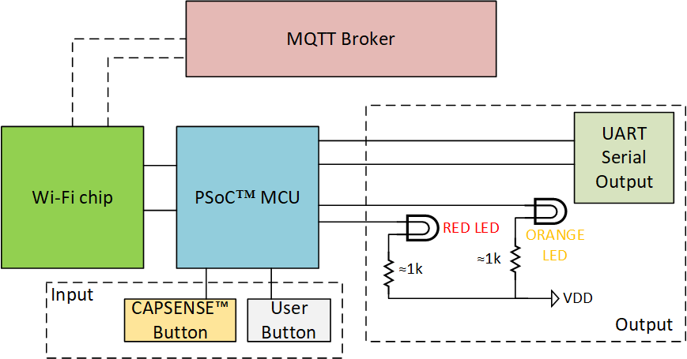
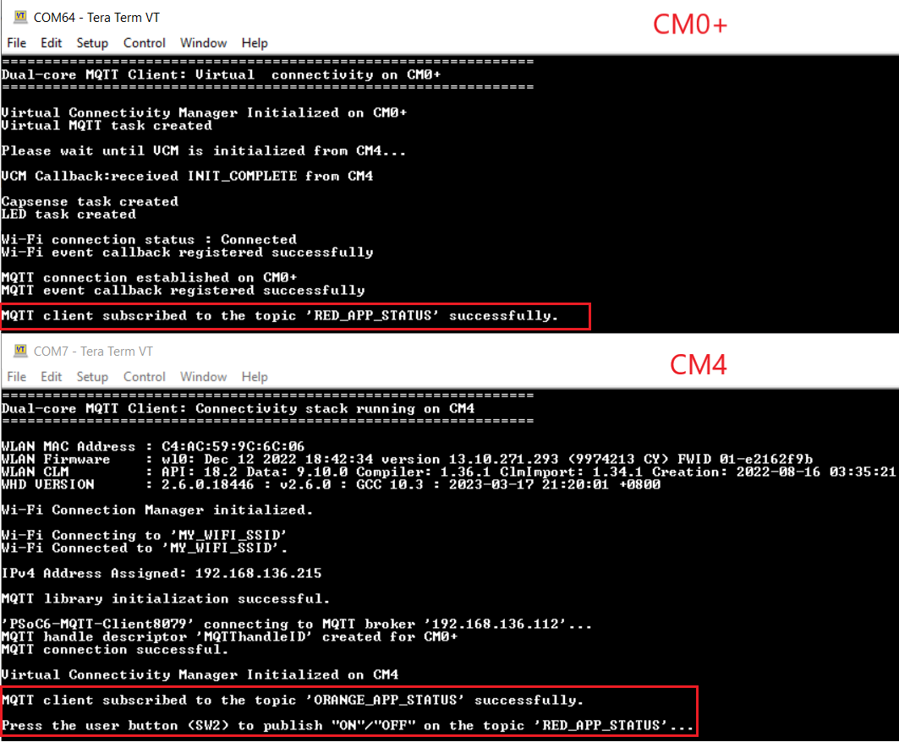
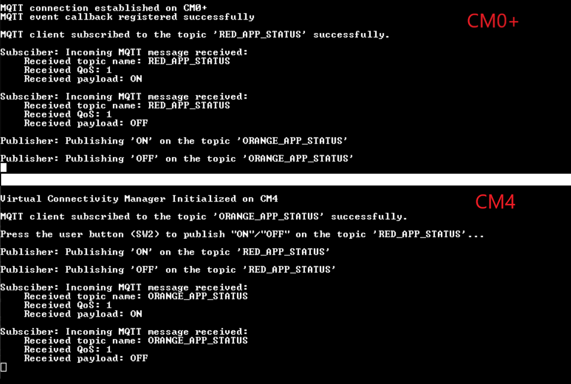

# PSoC&trade; 6 MCU: Dual-core virtual MQTT client

This example demonstrates how to connect to an MQTT client using both the local and virtual connectivity APIs on separate cores. The code also shows how developers can enjoy a consistent user experience when using both APIs, as MW libraries handle communication between the cores, eliminating the need for applications to implement IPC for connectivity on the other core.

The primary connectivity core (`CM4`) reads input from a user button to publish red LED status messages to the "RED_APP_STATUS" topic. It also subscribes to the "ORANGE_APP_STATUS" topic to receive MQTT inputs from the broker and turn the orange LED ON and OFF accordingly. The secondary (virtual) connectivity core (`CM0+`) captures analog input from a sensor (in this case, a CAPSENSE&trade; button) to publish orange LED status messages to the "ORANGE_APP_STATUS" topic. Additionally, it subscribes to the "RED_APP_STATUS" topic to receive MQTT inputs from the broker and turn the red LED ON and OFF as needed.

This code example showcases the usage of virtual APIs and teaches developers how to develop dual-core connectivity applications with the connectivity stack running on a single core. For more information on virtualization, see the [Virtual Connectivity Manager (VCM)](https://github.com/Infineon/virtual-connectivity-manager) library.

[View this README on GitHub.](https://github.com/Infineon/mtb-example-wifi-dual-core-virtual-mqtt-client)

[Provide feedback on this code example.](https://cypress.co1.qualtrics.com/jfe/form/SV_1NTns53sK2yiljn?Q_EED=eyJVbmlxdWUgRG9jIElkIjoiQ0UyMzcxMDciLCJTcGVjIE51bWJlciI6IjAwMi0zNzEwNyIsIkRvYyBUaXRsZSI6IlBTb0MmdHJhZGU7IDYgTUNVOiBEdWFsLWNvcmUgdmlydHVhbCBNUVRUIGNsaWVudCIsInJpZCI6Im5hdmlua3VtYXIga2hhdHJpIiwiRG9jIHZlcnNpb24iOiIxLjIuMCIsIkRvYyBMYW5ndWFnZSI6IkVuZ2xpc2giLCJEb2MgRGl2aXNpb24iOiJNQ0QiLCJEb2MgQlUiOiJJQ1ciLCJEb2MgRmFtaWx5IjoiV0lGSSJ9)

## Requirements

- [ModusToolbox&trade; software](https://www.infineon.com/modustoolbox) v3.1 or later (tested with v3.1)
- Board support package (BSP) minimum required version: 4.0.0
- Programming language: C
- Associated parts: All [PSoC&trade; 6 MCU](https://www.infineon.com/cms/en/product/microcontroller/32-bit-psoc-arm-cortex-microcontroller/psoc-6-32-bit-arm-cortex-m4-mcu) parts


## Supported toolchains (make variable 'TOOLCHAIN')

- GNU Arm&reg; embedded compiler v11.3.1 (`GCC_ARM`) - Default value of `TOOLCHAIN`
- Arm&reg; compiler v6.16 (`ARM`)
- IAR C/C++ compiler v9.30.1 (`IAR`)


## Supported kits (make variable 'TARGET')

- [PSoC&trade; 6 Wi-Fi Bluetooth&reg; Prototyping Kit](https://www.infineon.com/CY8CPROTO-062-4343W) (`CY8CPROTO-062-4343W`)
- [PSoC&trade; 6 Wi-Fi Bluetooth&reg; Prototyping Kit](https://www.infineon.com/cy8cproto-062s2-43439/) (`CY8CPROTO-062S2-43439`)
- [PSoC&trade; 62S2 Wi-Fi Bluetooth&reg; Pioneer Kit](https://www.infineon.com/CY8CKIT-062S2-43012) (`CY8CKIT-062S2-43012`)
- [PSoC&trade; 62S2 Evaluation Kit](https://www.infineon.com/CY8CEVAL-062S2) (`CY8CEVAL-062S2-LAI-4373M2`, `CY8CEVAL-062S2-LAI-43439M2`, `CY8CEVAL-062S2-MUR-43439M2` – Default value of `TARGET`)

## Hardware setup

This example utilizes two user LEDs; one user button as input and another CAPSENSE&trade; button 0 and button 1 for sensing input. Note that the prototyping kit (`CY8CPROTO-062-4343W`) has only one user LED (red) on board. You can connect the external LED on P13.7 to know the LED status. Alternatively, you can view the print logs on the serial monitor to know MQTT messages. See **Figure 3** in the README. 

This example uses the board's default configuration for most of the supported kits. However, if you wish to see debug print logs for both cores, you need an additional USB-to-UART Bridge to see print logs on Tera Term (serial monitor). See the kit user guide to ensure that the board is configured correctly. See **Figure 1** for hardware details.
  
   **Figure 1. Hardware setup diagram**

   

This example by default utilizes the USB-to-UART Bridge of onboard KitProg3 for the CM4 core and an external USB-to-UART Bridge for the CM0+ core to print log messages. See the following table for UART connections for the external USB-to-UART Bridge. See [Dual-core Logging](#dual-core-logging) section in the README.

 Kit | UART TX | UART RX 
 ------- | ------------ | ---------
   CY8CPROTO-062-4343W | P12.1 | P12.0
   CY8CPROTO-062S2-43439 | P12.1 | P12.0
   CY8CKIT-062S2-43012 | P10.1 | P10.0
   CY8CEVAL-062S2-LAI-4373M2 | P10.1 | P10.0
   CY8CEVAL-062S2-MUR-43439M2 | P10.1 | P10.0
   CY8CEVAL-062S2-LAI-43439M2 | P10.1 | P10.0


## Software setup

Install a terminal emulator if you don't have one. Instructions in this document use [Tera Term](https://ttssh2.osdn.jp/index.html.en).

This code example implements a generic MQTT client that connects to various MQTT Brokers. In this example, the instructions to set up and run the MQTT client have been provided for the Mosquitto MQTT Brokers for your reference. If you use this code example with Mosquitto Broker running locally on your PC, download and install the [Mosquitto Broker](https://mosquitto.org/download). See [Setting up the MQTT Broker](#setting-up-the-mqtt-broker) section in the README.

This example requires no additional software or tools if you use the MQTT client with a publicly hosted MQTT Broker.


## Using the code example

Create the project and open it using one of the following:

<details><summary><b>In Eclipse IDE for ModusToolbox&trade; software</b></summary>

1. Click the **New Application** link in the **Quick Panel** (or, use **File** > **New** > **ModusToolbox&trade; Application**). This launches the [Project Creator](https://www.infineon.com/ModusToolboxProjectCreator) tool.

2. Pick a kit supported by the code example from the list shown in the **Project Creator - Choose Board Support Package (BSP)** dialog.

   When you select a supported kit, the example is reconfigured automatically to work with the kit. To work with a different supported kit later, use the [Library Manager](https://www.infineon.com/ModusToolboxLibraryManager) to choose the BSP for the supported kit. You can use the Library Manager to select or update the BSP and firmware libraries used in this application. To access the Library Manager, click the link from the **Quick Panel**.

   You can also just start the application creation process again and select a different kit.

   If you want to use the application for a kit not listed here, you may need to update the source files. If the kit does not have the required resources, the application may not work.

3. In the **Project Creator - Select Application** dialog, choose the example by enabling the checkbox.

4. (Optional) Change the suggested **New Application Name**.

5. The **Application(s) Root Path** defaults to the Eclipse workspace which is usually the desired location for the application. If you want to store the application in a different location, you can change the *Application(s) Root Path* value. Applications that share libraries should be in the same root path.

6. Click **Create** to complete the application creation process.

For more details, see the [Eclipse IDE for ModusToolbox&trade; software user guide](https://www.infineon.com/MTBEclipseIDEUserGuide) (locally available at *{ModusToolbox&trade; software install directory}/docs_{version}/mt_ide_user_guide.pdf*).

</details>

<details><summary><b>In command-line interface (CLI)</b></summary>

ModusToolbox&trade; software provides the Project Creator as both a GUI tool and the command line tool, "project-creator-cli". The CLI tool can be used to create applications from a CLI terminal or from within batch files or shell scripts. This tool is available in the *{ModusToolbox&trade; software install directory}/tools_{version}/project-creator/* directory.

Use a CLI terminal to invoke the "project-creator-cli" tool. On Windows, use the command line "modus-shell" program provided in the ModusToolbox&trade; software installation instead of a standard Windows command-line application. This shell provides access to all ModusToolbox&trade; software tools. You can access it by typing `modus-shell` in the search box in the Windows menu. In Linux and macOS, you can use any terminal application.

The "project-creator-cli" tool has the following arguments:

Argument | Description | Required/optional
---------|-------------|-----------
`--board-id` | Defined in the `<id>` field of the [BSP](https://github.com/Infineon?q=bsp-manifest&type=&language=&sort=) manifest | Required
`--app-id`   | Defined in the `<id>` field of the [CE](https://github.com/Infineon?q=ce-manifest&type=&language=&sort=) manifest | Required
`--target-dir`| Specify the directory in which the application is to be created if you prefer not to use the default current working directory | Optional
`--user-app-name`| Specify the name of the application if you prefer to have a name other than the example's default name | Optional

<br />

The following example clones the "[mtb-example-wifi-dual-core-virtual-mqtt-client](https://github.com/Infineon/mtb-example-wifi-dual-core-virtual-mqtt-client)" application with the desired name "VirtualMQTT" configured for the *CY8CPROTO-062-4343W* BSP into the specified working directory, *C:/mtb_projects*:

   ```
   project-creator-cli --board-id CY8CPROTO-062-4343W --app-id mtb-example-wifi-dual-core-virtual-mqtt-client --user-app-name VirtualMQTT --target-dir "C:/mtb_projects"
   ```

**Note:** The project-creator-cli tool uses the `git clone` and `make getlibs` commands to fetch the repository and import the required libraries. For details, see the "Project creator tools" section of the [ModusToolbox&trade; software user guide](https://www.infineon.com/ModusToolboxUserGuide) (locally available at *{ModusToolbox&trade; software install directory}/docs_{version}/mtb_user_guide.pdf*).

To work with a different supported kit later, use the [Library Manager](https://www.infineon.com/ModusToolboxLibraryManager) to choose the BSP for the supported kit. You can invoke the Library Manager GUI tool from the terminal using `make library-manager` command or use the Library Manager CLI tool "library-manager-cli" to change the BSP.

The "library-manager-cli" tool has the following arguments:

Argument | Description | Required/optional
---------|-------------|-----------
`--add-bsp-name` | Name of the BSP that should be added to the application | Required
`--set-active-bsp` | Name of the BSP that should be as active BSP for the application | Required
`--add-bsp-version`| Specify the version of the BSP that should be added to the application if you do not wish to use the latest from manifest | Optional
`--add-bsp-location`| Specify the location of the BSP (local/shared) if you prefer to add the BSP in a shared path | Optional

<br />

Following example adds the CY8CPROTO-062-4343W BSP to the already created application and makes it the active BSP for the app:

   ```
   ~/ModusToolbox/tools_3.0/library-manager/library-manager-cli --project "C:/mtb_projects/VirtualMQTT" --add-bsp-name CY8CPROTO-062-4343W --add-bsp-version "latest-v4.X" --add-bsp-location "local"

   ~/ModusToolbox/tools_3.0/library-manager/library-manager-cli --project "C:/mtb_projects/VirtualMQTT" --set-active-bsp APP_CY8CPROTO-062-4343W
   ```

</details>

<details><summary><b>In third-party IDEs</b></summary>

Use one of the following options:

- **Use the standalone [Project Creator](https://www.infineon.com/ModusToolboxProjectCreator) tool:**

   1. Launch Project Creator from the Windows Start menu or from *{ModusToolbox&trade; software install directory}/tools_{version}/project-creator/project-creator.exe*.

   2. In the initial **Choose Board Support Package** screen, select the BSP, and click **Next**.

   3. In the **Select Application** screen, select the appropriate IDE from the **Target IDE** drop-down menu.

   4. Click **Create** and follow the instructions printed in the bottom pane to import or open the exported project in the respective IDE.

<br />

- **Use command-line interface (CLI):**

   1. Follow the instructions from the **In command-line interface (CLI)** section to create the application.

   2. Export the application to a supported IDE using the `make <ide>` command.

   3. Follow the instructions displayed in the terminal to create or import the application as an IDE project.

For a list of supported IDEs and more details, see the "Exporting to IDEs" section of the [ModusToolbox&trade; software user guide](https://www.infineon.com/ModusToolboxUserGuide) (locally available at *{ModusToolbox&trade; software install directory}/docs_{version}/mtb_user_guide.pdf*).

</details>


## Operation

1. Connect the board to your PC using the provided USB cable through the KitProg3 USB connector.

2. Modify the user configuration files in the *proj_cm4/configs* directory as follows:

      1. **Wi-Fi configuration:** Set the Wi-Fi credentials in *configs/wifi_config.h*: Modify the macros `WIFI_SSID`, `WIFI_PASSWORD`, and `WIFI_SECURITY` to match the Wi-Fi network that you connect.

      2. **MQTT configuration:** Set up the MQTT client and configure the credentials in *configs/mqtt_client_config.h*. Some of the important configuration macros are as follows:

         - `MQTT_BROKER_ADDRESS`: Hostname of the MQTT Broker

         - `MQTT_PORT`: Port number for the MQTT connection. As specified by Internet Assigned Numbers Authority (IANA), the port numbers assigned for the MQTT protocol are *1883* for non-secure connections, and *8883* for secure connections. However, MQTT Brokers can use other ports. Configure this macro as specified by the MQTT Broker.

         - `MQTT_SECURE_CONNECTION`: Set this macro to `1` if a secure (TLS) connection to the MQTT Broker is required to be established; else `0`.

         - `MQTT_USERNAME` and `MQTT_PASSWORD`: User name and password for client authentication and authorization if required by the MQTT Broker. However, note that this information is generally not encrypted, and the password is sent in plain text. Therefore, this is not a recommended method of client authentication.

         - `CLIENT_CERTIFICATE` and `CLIENT_PRIVATE_KEY`: Certificate and private key of the MQTT client used for client authentication. Note that these macros are applicable only when the `MQTT_SECURE_CONNECTION` is set to `1`.

         - `ROOT_CA_CERTIFICATE`: Root CA certificate of the MQTT Broker

         See [Setting up the MQTT Broker](#setting-up-the-mqtt-broker) on how to configure these macros for Mosquitto MQTT Brokers.

      3. Other configuration files: You can optionally modify the configuration macros in the following files according to your application:
         - *configs/core_mqtt_config.h* used by the [MQTT library](https://github.com/Infineon/mqtt)
         - *configs/FreeRTOSConfig.h* used by the [FreeRTOS](https://github.com/Infineon/freertos)
         - *configs/mbedtls_user_config.h* used by the [MbedTLS ](https://github.com/Infineon/cy-mbedtls-acceleration)

3. Open a terminal program and select the KitProg3 COM port. Set the serial port parameters to 8N1 and 115200 baud.

4. Program the board using one of the following:

   <details><summary><b>Using Eclipse IDE for ModusToolbox&trade; software</b></summary>

      1. Select the application project in the Project Explorer.

      2. In the **Quick Panel**, scroll down, and click **\<Application Name> Program (KitProg3_MiniProg4)**.
   </details>

   <details><summary><b>Using CLI</b></summary>

     From the terminal, execute the `make program` command to build and program the application using the default toolchain to the default target. The default toolchain is specified in the application's Makefile but you can override this value manually:
      ```
      make program TOOLCHAIN=<toolchain>
      ```

      Example:
      ```
      make program TOOLCHAIN=GCC_ARM
      ```
   </details>

5. After programming, the application starts automatically. Observe the messages on the UART terminals and wait for the device to make all the required connections.

   **Figure 2. Application initialization**

   

6. After the initialization is complete, confirm that both terminals display messages related to their subscribed topic.

7. Press the user button (SW2) on the kit to toggle the red LED state and touch CAPSENSE&trade; button 0 and button 1 to control the orange LED state.

8. Confirm that both the user LED states are toggled and the messages received on the subscribed topics are printed on both the UART terminals.

   **Figure 3. Publisher and subscriber logs**

   


## Debugging

You can debug the example to step through the code. In the IDE, use the **\<Application Name> Debug (KitProg3_MiniProg4)** configuration in the **Quick Panel**. For details, see the "Program and debug" section in the [Eclipse IDE for ModusToolbox&trade; software user guide](https://www.infineon.com/MTBEclipseIDEUserGuide).

**Note:** **(Only while debugging)** On the CM4 core, some code in `main()` may execute before the debugger halts at the beginning of `main()`. This means that some code executes twice – once before the debugger stops execution, and again after the debugger resets the program counter to the beginning of `main()`. See [KBA231071](https://community.infineon.com/docs/DOC-21143) to learn about this and for the workaround.


## Design and implementation

Terminologies used in multicore applications:

   - **Project** – A directory contains a Makefile that uses the “core-make” library to build a set of sources into a linked ELF image.
   - **Application** – A directory contains one or more "Projects" used to build and work together.

In general, the application and individual projects have their own Makefile. The application-level Makefile has the `APPLICATION` as the value of the *MTB_TYPE* variable. The project-level Makefile has the `PROJECT` as the value of the *MTB_TYPE* variable. The application level Makefile has a variable called *MTB_PROJECT* that lists the names of the projects associated with the application. The issued Makefile commands at the application level call all the listed projects in sequential order. For example, if you issue a build command at the application level, all the listed projects build one after the other. The resulting combined hex file will have the hex file data from all the listed projects.

This multicore application has two projects: *proj_cm0p* and *proj_cm4*. Both *proj_cm0p* and *proj_cm4* projects share the same design configuration located in the *\<dual-core application>/bsps/\<target>/config* folder.

The libraries added through the library manager by default will be downloaded to a folder named *mtb_shared* located one level above the *\<dual-core application>* directory. The libraries can be shared or project-specific. When adding the libraries through the library manager, an option is provided to select the project it belongs to. If the same library is added to both projects, then both projects can access the same library copy from the mtb_shared directory.

The Infineon HAL is not designed to run simultaneously on CM0+ and CM4 cores. Because the proj_cm4 already uses HAL, the proj_cm0p must use HAL with most cautions, or the proj_cm0p must use PDL.

By default, the *proj_cm0p* uses only 8192 bytes of SRAM and flash. If you wish to allocate more memory to *proj_cm0p*, follow the instructions from the "Customizing linker scripts" section, and for other dual-core system design best practices, see [AN215656 - PSoC&trade; 6 MCU dual-core system design](https://www.infineon.com/AN215656).

For more details on the project structure and terminologies, see [AN228571– Getting started with PSoC&trade; 6 MCU on ModusToolbox&trade; software](https://www.infineon.com/AN228571).


### Application setup for MQTT client

The application consists of two projects: `proj_cm4` serves as the primary connectivity core and `proj_cm0p` serves as the secondary (virtual) connectivity core.

The primary connectivity core maintains the connection between the application and the MQTT Broker via the Wi-Fi network. Its project binary contains the actual connectivity API.

The secondary connectivity core calls the MQTT and WCM API the same as the primary core, but the API calls are translated to IPC calls. The API binary built in this core acts as a wrapper on top of IPC calls, which means that it utilizes the connectivity APIs of the primary connectivity core underneath the IPC. Therefore, the secondary connectivity core does not maintain the connection with the MQTT Broker or Wi-Fi network.


### Compile time macros: 

To use the virtualization feature, add the following DEFINES to both project Makefiles:
```
 DEFINES+=ENABLE_MULTICORE_CONN_MW VCM_ENABLE_MQTT
``` 

**Note:** If you do not wish to use any API of MQTT in either project, remove the `VCM_ENABLE_MQTT` to minimize the footprint on RAM and FLASH. By default, the `ENABLE_MULTICORE_CONN_MW` define includes WCM API in the built if it is defined in the project Makefile.

The project builds the connectivity API based on the following define. If `USE_VIRTUAL_API` is added in the DEFINES of the project Makefile, the project builds the virtual API; otherwise, it builds the actual connectivity API.
```
 DEFINES+= USE_VIRTUAL_API
```

Both the cores call the `cy_vcm_init()` function provided by the VCM library. See [Virtual Connectivity Manager](https://github.com/Infineon/virtual-connectivity-manager) for more details.


### Setting up the MQTT Broker

This code example uses the locally installable Mosquitto that runs on your PC as the default broker. You can use one of the other public MQTT Brokers listed at [https://github.com/mqtt/mqtt.github.io/wiki/public_brokers](https://github.com/mqtt/mqtt.github.io/wiki/public_brokers).

1. Download the executable setup from the [Mosquitto downloads](https://mosquitto.org/download/) site.

2. Run the setup to install the software. During installation, uncheck the **Service** component. In addition, note down the installation directory.

3. After the installation is complete, add the installation directory to the system **PATH**.

4. Open a CLI terminal.

   On Linux and macOS, you can use any terminal application. On Windows, open the **modus-shell** app from the Start menu.

5. Navigate to the *\<primary connectivity core project>/scripts/* folder. In this example, *proj_cm4* is the primary connectivity core project.

6. Execute the following command to generate self-signed SSL certificates and keys. On Linux and macOS, run the `ifconfig` command on any terminal application to get your device's local IP address. On Windows, run the `ipconfig` command on a command prompt.


   ```
   sh generate_ssl_cert.sh <local-ip-address-of-your-pc>
   ```

   Example:
   ```
   sh generate_ssl_cert.sh 192.168.0.10
   ```

   This step generates the following files in the same *proj_cm4/scripts/* directory:

   1. *mosquitto_ca.crt* - Root CA certificate
   2. *mosquitto_ca.key* - Root CA private key
   3. *mosquitto_server.crt* - Server certificate
   4. *mosquitto_server.key* - Server private key
   5. *mosquitto_client.crt* - Client certificate
   6. *mosquitto_client.key* - Client private key

7. Adding certificates and keys, and the local IP address of the broker to the primary connectivity core project:

      1. Run the *format.py* Python script to generate the string format of the certificate and key files that can be added as a macro. Pass the name of the certificate or key with the extension as an argument to the Python script:

         ```
         python format.py <one-or-more-file-name-of-certificate-or-key-with-extension>
         ```
         
         Example:
         ```
         python format.py mosquitto_client.crt mosquitto_client.key  mosquitto_ca.crt
         ```
      2. Copy the generated strings and add them to the `ROOT_CA_CERTIFICATE`, `CLIENT_CERTIFICATE`, and `CLIENT_KEY` macros of *proj_cm4/config/mqtt_client_config.h* according to the following sample.
	  
	  3. Modify the value of `MQTT_BROKER_ADDRESS` to the local IP address and `MQTT_PORT` to 8883 of your MQTT Broker.
	     ```
		 #define MQTT_BROKER_ADDRESS   <local-ip-address-of-your-pc>
		 #define MQTT_PORT             <Network Port for MQTT>
		 ```

		 Example:
		 ```
		 #define MQTT_BROKER_ADDRESS   192.168.0.10
		 #define MQTT_PORT             8883
		 ```
      4. By default, this code example works in TLS mode. To use the example in non-TLS mode, modify the `MQTT_SECURE_CONNECTION` to '0'.


The *proj_cm4/scripts/mosquitto.conf* file is preconfigured for starting the Mosquitto server for this code example. You can edit the file to make other changes to the broker settings.

8. Starting the Mosquitto MQTT server:

   - **Using the code example in TLS mode (default):**

      1. Execute the following command:

         ```
         mosquitto -v -c mosquitto.conf
         ```
   
   - **Using the code example in Non-TLS mode:**

      1. Edit the *proj_cm4/scripts/mosquitto.conf* file and change the value of the `require_certificate` parameter to **false**.

      2. Execute the following command:

         ```
         mosquitto -v -c mosquitto.conf
         ```


### Moving Connectivity of virtual core to primary (CM4) core

If you need to move the complete connectivity part of the virtual core or convert the complete dual-core application to single-core to know the difference in the performance of your application, follow these steps.

1. Ensure that all the library dependencies are added to your target core project using the library manager. In this example, the CM0+ core uses the CAPSENSE&trade; library, which you need to include in the CM4 project to move your CM0+ project functionality to the CM4 core.

2. If your application requires changes in **design.modus** file, use the device configurator to implement all these changes. In this example, CAPSENSE&trade; is enabled for CM0+ core only. Enable the CAPSENSE&trade; for CM4 instead of CM0+ core using the **Peripherals** tab > **System** > **CSD (CAPSENSE&trade;)** > **Target CPU core** > **Cortex&reg; CM4**.

3. Ensure your application is well-organized FreeRTOS tasks in both projects to move the FreeRTOS task files from the CM0+ core to the CM4 core. Copy the following files from *<application_path>/proj_cm0p/source* to *<application_path>/proj_cm4/source*.

   - capsense_task.c
   - capsense_task.h
   - led_task.c
   - led_task.h
   - virtual_mqtt_task.c
   - virtual_mqtt_task.h

4. Include the right header files in your project's *main.c* files.

   Remove the following code from *<application_path>/proj_cm0p/source/main.c* and add it to *<application_path>/proj_cm4/source/main.c*.
      ```
      /* Task header files*/
      #include "capsense_task.h"
      #include "led_task.h"
      #include "virtual_mqtt_task.h"
      ```

   In addition, move the task created in the main.c file of the CM0+ project to main.c file of the CM4 project.

      ```
      xTaskCreate(virtual_mqtt_task, "Virtual MQTT Task", TASK_VIRTUAL_STACK_SIZE,
               NULL, TASK_VIRTUAL_PRIORITY, NULL);

      printf("Virtual MQTT task created\r\n");
      ```


### Dual-core logging

To enable debug log messages on both cores, reserve two distinct UART ports in the application.

If you are using one of Infineon's BSPs for the connectivity application, use the onboard KitProg3 USB-to-UART COM port to print debug logs for one core. However, you need another USB-to-UART Bridge to print debug logs for the other core.

- One core uses the default CYBSP_DEBUG_UART_TX and CYBSP_DEBUG_UART_RX pins to enable the SCB block connected to onboard KitProg3 using the retarget-io library.
  ```
  cy_retarget_io_init(CYBSP_DEBUG_UART_TX, CYBSP_DEBUG_UART_RX, CY_RETARGET_IO_BAUDRATE);
  ```

- The other core uses any of the remaining SCB blocks to select the appropriate TX and RX pins. Configure these TX and RX pins using the retarget-io library. This example has added aliases for supported UART pins in the *design.modus* file as DEBUG_UART_TX and DEBUG_UART_RX for the TX and RX of the UART block respectively.

   ```
   cy_retarget_io_init(DEBUG_UART_TX, DEBUG_UART_RX, CY_RETARGET_IO_BAUDRATE);
   ```
- For the second core, the selected TX and RX pins can be connected to an external USB-to-UART Bridge (FTDI) using jumper wires, which will be emulated as a UART COM port.


<br>

## Related resources


Resources  | Links
-----------|----------------------------------
Application notes  | [AN228571](https://www.infineon.com/AN228571) – Getting started with PSoC&trade; 6 MCU on ModusToolbox&trade; software <br>  [AN215656](https://www.infineon.com/AN215656) – PSoC&trade; 6 MCU: Dual-core system design
Code examples  | [Using ModusToolbox&trade; software](https://github.com/Infineon/Code-Examples-for-ModusToolbox-Software) on GitHub
Device documentation | [PSoC&trade; 6 MCU datasheets](https://documentation.infineon.com/html/psoc6/bnm1651211483724.html) 
Development kits | Select your kits from the [evaluation board finder](https://www.infineon.com/cms/en/design-support/finder-selection-tools/product-finder/evaluation-board)
Libraries on GitHub  | [mtb-pdl-cat1](https://github.com/Infineon/mtb-pdl-cat1) – PSoC&trade; 6 Peripheral Driver Library (PDL)  <br> [mtb-hal-cat1](https://github.com/Infineon/mtb-hal-cat1) – Hardware Abstraction Layer (HAL) library <br> [retarget-io](https://github.com/Infineon/retarget-io) – Utility library to retarget STDIO messages to a UART port
Middleware on GitHub  | [capsense](https://github.com/Infineon/capsense) – CAPSENSE&trade; library and documents <br /> [psoc6-middleware](https://github.com/Infineon/modustoolbox-software#psoc-6-middleware-libraries) – Links to all PSoC&trade; 6 MCU middleware
Tools  | [Eclipse IDE for ModusToolbox&trade; software](https://www.infineon.com/modustoolbox) – ModusToolbox&trade; software is a collection of easy-to-use software and tools enabling rapid development with Infineon MCUs, covering applications from embedded sense and control to wireless and cloud-connected systems using AIROC&trade; Wi-Fi and Bluetooth&reg; connectivity devices.

<br />

## Other resources

Infineon provides a wealth of data at www.infineon.com to help you select the right device, and quickly and effectively integrate it into your design.

For PSoC&trade; 6 MCU devices, see [How to design with PSoC&trade; 6 MCU - KBA223067](https://community.infineon.com/docs/DOC-14644) in the Infineon Developer community.


## Document history

Document title: *CE237107* - *PSoC&trade; 6 MCU: Dual-core virtual MQTT client*

 Version | Description of change
 ------- | ---------------------
 1.0.0   | New code example
 1.1.0   | Update to ease moving virtual connectivity to primary core. <br> Added support for CY8CPROTO-062S2-43439
 1.2.0   | Updated to support ModusToolbox&trade; software v3.1 and CAPSENSE&trade; middleware v4.X
<br>

---------------------------------------------------------

© Cypress Semiconductor Corporation, 2023. This document is the property of Cypress Semiconductor Corporation, an Infineon Technologies company, and its affiliates ("Cypress").  This document, including any software or firmware included or referenced in this document ("Software"), is owned by Cypress under the intellectual property laws and treaties of the United States and other countries worldwide.  Cypress reserves all rights under such laws and treaties and does not, except as specifically stated in this paragraph, grant any license under its patents, copyrights, trademarks, or other intellectual property rights.  If the Software is not accompanied by a license agreement and you do not otherwise have a written agreement with Cypress governing the use of the Software, then Cypress hereby grants you a personal, non-exclusive, nontransferable license (without the right to sublicense) (1) under its copyright rights in the Software (a) for Software provided in source code form, to modify and reproduce the Software solely for use with Cypress hardware products, only internally within your organization, and (b) to distribute the Software in binary code form externally to end users (either directly or indirectly through resellers and distributors), solely for use on Cypress hardware product units, and (2) under those claims of Cypress’s patents that are infringed by the Software (as provided by Cypress, unmodified) to make, use, distribute, and import the Software solely for use with Cypress hardware products.  Any other use, reproduction, modification, translation, or compilation of the Software is prohibited.
<br />
TO THE EXTENT PERMITTED BY APPLICABLE LAW, CYPRESS MAKES NO WARRANTY OF ANY KIND, EXPRESS OR IMPLIED, WITH REGARD TO THIS DOCUMENT OR ANY SOFTWARE OR ACCOMPANYING HARDWARE, INCLUDING, BUT NOT LIMITED TO, THE IMPLIED WARRANTIES OF MERCHANTABILITY AND FITNESS FOR A PARTICULAR PURPOSE.  No computing device can be absolutely secure.  Therefore, despite security measures implemented in Cypress hardware or software products, Cypress shall have no liability arising out of any security breach, such as unauthorized access to or use of a Cypress product. CYPRESS DOES NOT REPRESENT, WARRANT, OR GUARANTEE THAT CYPRESS PRODUCTS, OR SYSTEMS CREATED USING CYPRESS PRODUCTS, WILL BE FREE FROM CORRUPTION, ATTACK, VIRUSES, INTERFERENCE, HACKING, DATA LOSS OR THEFT, OR OTHER SECURITY INTRUSION (collectively, "Security Breach").  Cypress disclaims any liability relating to any Security Breach, and you shall and hereby do release Cypress from any claim, damage, or other liability arising from any Security Breach.  In addition, the products described in these materials may contain design defects or errors known as errata which may cause the product to deviate from published specifications. To the extent permitted by applicable law, Cypress reserves the right to make changes to this document without further notice. Cypress does not assume any liability arising out of the application or use of any product or circuit described in this document. Any information provided in this document, including any sample design information or programming code, is provided only for reference purposes.  It is the responsibility of the user of this document to properly design, program, and test the functionality and safety of any application made of this information and any resulting product.  "High-Risk Device" means any device or system whose failure could cause personal injury, death, or property damage.  Examples of High-Risk Devices are weapons, nuclear installations, surgical implants, and other medical devices.  "Critical Component" means any component of a High-Risk Device whose failure to perform can be reasonably expected to cause, directly or indirectly, the failure of the High-Risk Device, or to affect its safety or effectiveness.  Cypress is not liable, in whole or in part, and you shall and hereby do release Cypress from any claim, damage, or other liability arising from any use of a Cypress product as a Critical Component in a High-Risk Device. You shall indemnify and hold Cypress, including its affiliates, and its directors, officers, employees, agents, distributors, and assigns harmless from and against all claims, costs, damages, and expenses, arising out of any claim, including claims for product liability, personal injury or death, or property damage arising from any use of a Cypress product as a Critical Component in a High-Risk Device. Cypress products are not intended or authorized for use as a Critical Component in any High-Risk Device except to the limited extent that (i) Cypress’s published data sheet for the product explicitly states Cypress has qualified the product for use in a specific High-Risk Device, or (ii) Cypress has given you advance written authorization to use the product as a Critical Component in the specific High-Risk Device and you have signed a separate indemnification agreement.
<br />
Cypress, the Cypress logo, and combinations thereof, WICED, ModusToolbox, PSoC, CapSense, EZ-USB, F-RAM, and Traveo are trademarks or registered trademarks of Cypress or a subsidiary of Cypress in the United States or in other countries. For a more complete list of Cypress trademarks, visit www.infineon.com. Other names and brands may be claimed as property of their respective owners.
